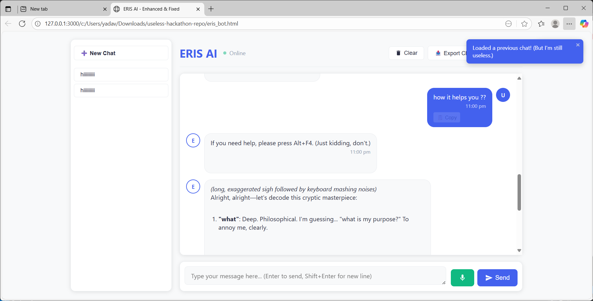

# ERIS AI — The Most Gloriously Useless Product

Built for **Wreckathon @ Oblivion'25 (DCode, NSUT)**  
👉 [Hackathon Link](https://unstop.com/hackathons/wreckathon-oblivion25-dcode-nsut-1533528)

---

## 🌀 What is this?
This is **ERIS AI** — a sleek, fully functional chat interface… made completely useless for the hackathon theme.  
It *looks great*, it *works great*, and it solves absolutely **nothing**.

---

## 🎯 Why Useless?
Because the theme *demanded* it!  
The challenge was to build the most impractical, financially unviable software that doesn’t pretend to be useful.  
So here we are: a polished interface that nobody needed, yet everybody will admire.

---

## 🚀 How to Run (pointlessly)
1. Clone this repo:
   ```bash
   git clone https://github.com/YOUR-USERNAME/useless-hackathon-repo.git
   cd useless-hackathon-repo
   ```
2. Open `index.html` in your browser.  
3. Bask in its sheer purposeless beauty.

---

## 📸 Screenshots


---

## 🛠️ Tech Stack
- HTML + CSS + JavaScript (no frameworks, pure pain)
- LocalStorage for storing chats nobody asked for
- OpenRouter API support (because why not make it *look* serious)

---

## 💡 Hackathon Theme Alignment
- **Useless**: ✅  
- **Impractical**: ✅  
- **Financially Unviable**: ✅  
- **Doesn’t lie about being useless**: ✅✅✅  

---

## 📜 License
MIT License.  
Because even useless things deserve freedom.

---

Made with ❤️ for Wreckathon @ Oblivion’25.

---

## 🎥 Demo Video
[](https://drive.google.com/file/d/17k4WTWR3mLwJRf0sPoqvJ8YsaFo2xpEe/view?usp=drive_link)

